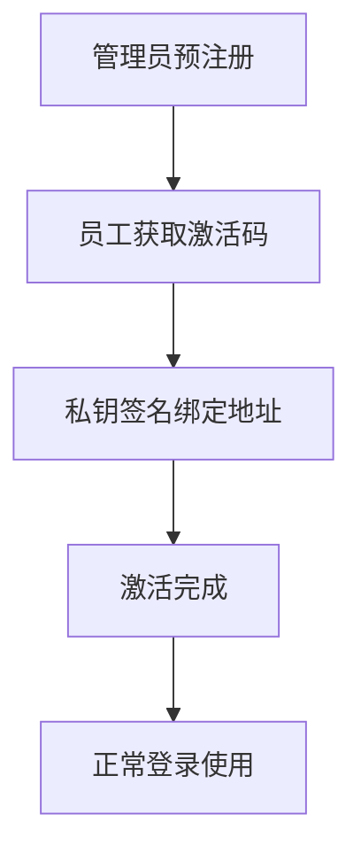
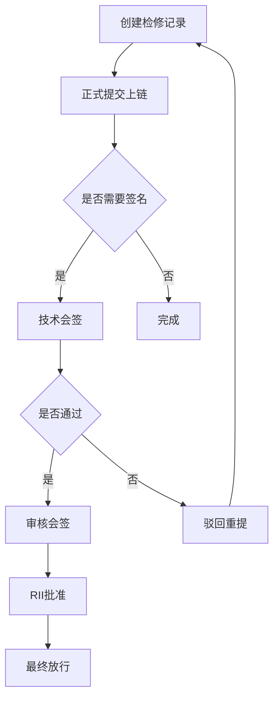

# 民航检修记录存证系统

<div align="center">

[](https://nodejs.org/)
[](https://vuejs.org/)
[](https://vitejs.dev/)
[](https://expressjs.com/)
[](https://mysql.com/)
[](https://soliditylang.org/)
[](https://hardhat.org/)
[](https://hyperledger.org/use/besu)

基于区块链技术的民航客机检修记录存证系统，采用"链下业务数据 + 链上关键摘要存证"架构，支持检修记录提交、多人签名审核、防篡改校验和权限化访问。

</div>

## 项目概览

<div align="center">

[](https://github.com)
[](https://github.com)
[](https://github.com)
[](https://github.com)

</div>

- **当前进度**: 78% 完成
- **项目阶段**: 后端主链路完成，产品化后台与管理能力完善中
- **技术栈**:
  - 前端: Vue 3 + Vite + Element Plus
  - 后端: Node.js + Express + ethers
  - 区块链: Hardhat (开发) / Hyperledger Besu QBFT (生产)
  - 数据库: MySQL
  - 智能合约: Solidity 0.8.24

## 系统架构

### 整体架构
```
┌─────────────────┐    ┌─────────────────┐    ┌─────────────────┐
│   Vue 3 前端     │────│  Node.js 后端   │────│   MySQL 数据库   │
│  - 认证页面      │    │  - 认证模块     │    │  - 用户管理     │
│  - 业务后台      │    │  - 检修模块     │    │  - 检修记录     │
│  - 审批工作台    │    │  - 区块链服务   │    │  - 签名管理     │
└─────────────────┘    └─────────┬───────┘    └─────────────────┘
                                   │
                         ┌─────────▼───────┐
                         │   区块链网络     │
                         │  - Hardhat 本地  │
                         │  - Besu QBFT    │
                         │  - 存证合约     │
                         └─────────────────┘
```

### 核心特性

- ✅ **链下链上分离**: 完整业务数据存于 MySQL，关键摘要哈希上链存证
- ✅ **多人签名流程**: 支持技术会签、审核会签、RII批准、最终放行等多阶段签名
- ✅ **版本化管理**: 驳回后生成新 revision，不覆盖历史记录，保留完整审计链路
- ✅ **防篡改验证**: 支持链下数据重新计算摘要与链上记录比对校验
- ✅ **权限控制**: RBAC 权限模型，支持角色、权限、用户映射管理
- ✅ **私钥安全**: 用户私钥仅保留在前端本地，后端不存储任何私钥信息

## 快速开始

### 环境要求

- Node.js 18+
- MySQL 8.x
- Windows PowerShell 或 PowerShell 7

### 安装依赖

```bash
# 后端依赖
cd backend
npm install

# 前端依赖
cd ../frontend
npm install
```

### 环境配置

1. 复制后端环境配置模板：
```bash
cd backend
cp .env.example .env
```

2. 编辑 `.env` 文件，配置数据库连接和其他参数：
```env
PORT=3000
DB_HOST=127.0.0.1
DB_PORT=3306
DB_NAME=aviation_maintenance
DB_USER=your_username
DB_PASSWORD=your_password
JWT_SECRET=your_jwt_secret
ADMIN_BOOTSTRAP_KEY=your_admin_key
```

### 数据库初始化

1. 创建数据库：
```sql
CREATE DATABASE aviation_maintenance CHARACTER SET utf8mb4 COLLATE utf8mb4_unicode_ci;
```

2. 导入初始化脚本：
```bash
# 认证相关表
mysql -h 127.0.0.1 -P 3306 -u root -p aviation_maintenance < backend/sql/init_auth.sql

# 检修业务表
mysql -h 127.0.0.1 -P 3306 -u root -p aviation_maintenance < backend/sql/init_maintenance_v2.sql
```

### 启动服务

#### 方式一：一键启动（推荐）

```bash
# Windows
startall.bat

# 或 PowerShell
.\startall.ps1
```

#### 方式二：手动启动

1. 启动本地区块链：
```bash
cd backend
npm run chain:node
```

2. 编译并部署合约：
```bash
cd backend
npm run chain:compile
npm run chain:deploy:v2
```

3. 启动后端服务：
```bash
cd backend
npm run dev
```

4. 启动前端服务：
```bash
cd frontend
npm run dev
```

### 访问系统

- 前端页面: http://127.0.0.1:5173
- 后端 API: http://127.0.0.1:3000
- 区块链 RPC: http://127.0.0.1:18545

## 项目结构

```
project/
├── backend/                    # Node.js 后端
│   ├── hardhat-local/          # Hardhat 本地链子项目
│   │   ├── contracts/          # Solidity 合约
│   │   └── hardhat.config.ts   # Hardhat 配置
│   ├── src/
│   │   ├── controllers/        # 控制器层
│   │   ├── services/           # 业务服务层
│   │   ├── models/             # 数据访问层
│   │   ├── routes/             # 路由定义
│   │   └── middlewares/        # 中间件
│   ├── scripts/                # 部署和测试脚本
│   ├── sql/                    # 数据库初始化脚本
│   └── storage/                # 文件存储目录
├── frontend/                   # Vue 3 前端
│   ├── src/
│   │   ├── pages/              # 页面组件
│   │   └── components/         # 通用组件
│   └── vite.config.js          # Vite 配置
└── docs/                       # 项目文档
    ├── 需求文档.md
    ├── 架构方案.md
    ├── 接口文档.md
    └── 环境配置与启动指南.md
```

## 核心模块

### 认证模块
- 管理员预注册员工账号
- 激活码 + 私钥签名地址绑定
- Challenge-Response 登录机制
- JWT 令牌认证

### 检修记录模块
- 检修记录创建与提交
- 多人多阶段签名流程
- 驳回与 revision 重提
- 记录查询与筛选

### 区块链存证模块
- 表单摘要哈希计算
- 附件 manifest 哈希管理
- 关键状态上链存证
- 防篡改校验接口

### 权限管理模块
- RBAC 权限模型
- 角色与权限配置
- 用户状态管理
- 签名模板管理

## 业务流程

### 用户注册流程


### 检修记录流程


## 测试账号

系统启动时会自动创建以下测试账号：

| 角色 | 工号 | 私钥 | 权限 |
|------|------|------|------|
| 提交工程师 | E1001 | 0xac0974... | 提交检修记录 |
| 审批工程师 | E2001 | 0x59c699... | 审核签名 |
| 放行工程师 | E2002 | 0x5de411... | 最终放行 |
| 系统管理员 | A9001 | 0x7c8521... | 用户管理 |

## 开发指南

### 合约开发
- 合约位于 `backend/hardhat-local/contracts/`
- 使用 `npm run chain:compile` 编译合约
- 使用 `npm run chain:deploy:v2` 部署合约

### 后端开发
- 控制器层: `backend/src/controllers/`
- 服务层: `backend/src/services/`
- 数据访问: `backend/src/models/`
- 新增接口请更新 `docs/接口文档.md`

### 前端开发
- 页面组件: `frontend/src/pages/`
- 通用组件: `frontend/src/components/`
- 认证页面: `AuthWorkspacePage.vue`
- 主后台页面: `WorkspaceShellPage.vue`

## 部署说明

### 生产环境部署
- 区块链: Hyperledger Besu QBFT 集群
- 后端: Node.js 应用部署
- 前端: Vite 构建产物部署
- 数据库: MySQL 主从架构

### 配置文件
- 后端配置: `backend/.env`
- 前端配置: `frontend/.env.production`
- 合约部署: `backend/hardhat-local/deployments/`

## 常见问题

### 后端启动失败
- 检查 `.env` 文件是否存在
- 确认 MySQL 服务是否启动
- 验证数据库连接参数是否正确

### 前端接口调用失败
- 确认后端服务是否正常运行
- 检查端口配置是否正确
- 清除浏览器缓存重新登录

### 区块链相关错误
- 确认 Hardhat 本地链是否启动
- 检查合约是否已正确部署
- 验证部署信息文件是否存在

## 贡献指南

1. Fork 项目到个人仓库
2. 创建功能分支进行开发
3. 提交 Pull Request
4. 等待代码审查和合并

## 许可证

本项目采用 MIT 许可证 - 查看 [LICENSE](LICENSE) 文件了解详情

## 联系我们

如有问题或建议，请提交 Issue 或联系项目维护者。

---

**最后更新**: 2026年3月8日
**版本**: v2.0.0
**状态**: 开发中 (78% 完成)