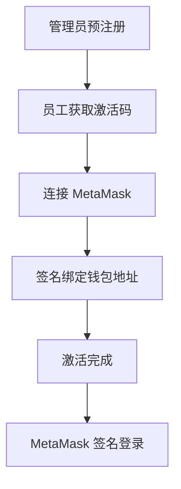
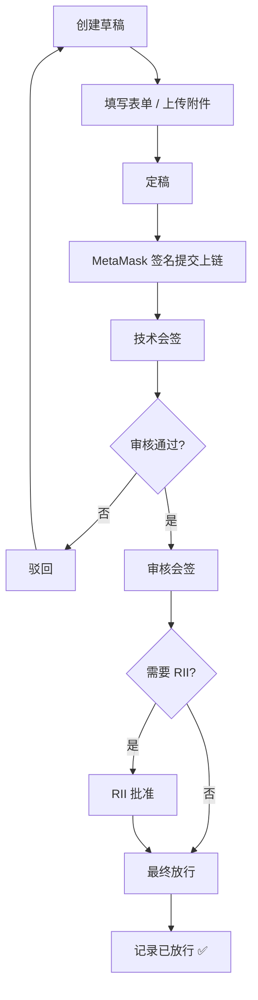
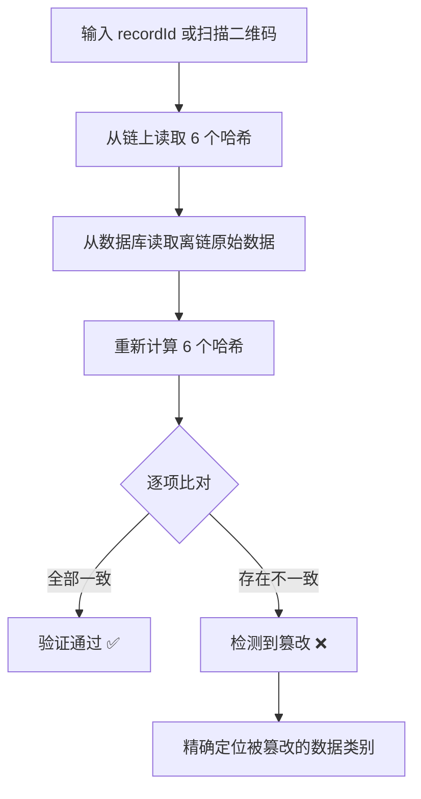

# 民航检修记录存证系统

<div align="center">

[](https://nodejs.org/)
[](https://vuejs.org/)
[](https://vitejs.dev/)
[](https://expressjs.com/)
[](https://mysql.com/)
[](https://soliditylang.org/)
[](https://hardhat.org/)
[](https://hyperledger.org/use/besu)
[](https://metamask.io/)

基于区块链技术的民航客机检修记录存证系统，采用「链下业务数据 + 链上关键摘要存证」架构，支持检修记录提交、多人签名审核、防篡改校验和权限化访问。

</div>

## 项目概览

<div align="center">

[](https://github.com)
[](https://github.com)
[](https://github.com)

</div>

**技术栈**:
- 前端: Vue 3 + Vite + Element Plus
- 后端: Node.js + Express + ethers.js
- 区块链: Hardhat（开发）/ Hyperledger Besu QBFT（生产）
- 数据库: MySQL 8
- 智能合约: Solidity 0.8.24
- AI 检测: YOLOv8 + 豆包多模态大模型

## 系统架构

```
┌─────────────────┐    ┌─────────────────┐    ┌─────────────────┐
│   Vue 3 前端     │────│  Node.js 后端   │────│   MySQL 数据库   │
│  - 认证页面      │    │  - 认证模块     │    │  - 用户管理     │
│  - 业务后台      │    │  - 检修模块     │    │  - 检修记录     │
│  - 审批工作台    │    │  - 区块链服务   │    │  - 签名管理     │
│  - 公开验证门户  │    │  - 验证服务     │    └─────────────────┘
│  - AI 图像检测   │    │  - PDF 服务     │
└─────────────────┘    │  - AI 分析服务  │
                       └─────────┬───────┘
                                 │
                    ┌────────────┴────────────┐
                    │                         │
          ┌─────────▼───────┐      ┌──────────▼──────┐
          │   区块链网络     │      │  Python 微服务   │
          │  - Hardhat 本地  │      │  - YOLOv8 检测  │
          │  - Besu QBFT    │      │  - 豆包 AI 分析  │
          │  - 存证合约     │      └─────────────────┘
          └─────────────────┘
```

## 核心特性

- ✅ **链下链上分离**: 完整业务数据存于 MySQL，6 项关键摘要哈希上链存证
- ✅ **MetaMask 全流程签名**: 注册、登录、提交、审批全部通过 MetaMask 完成，私钥永不暴露
- ✅ **多人多阶段签名**: 技术会签 → 审核会签 → RII 批准 → 最终放行，每步独立上链
- ✅ **版本链管理**: 驳回后生成新 revision，不覆盖历史，保留完整审计链路
- ✅ **公开验证门户**: 无需登录，6 项哈希逐一比对，签名链完整展示
- ✅ **篡改演示模块**: 管理员可模拟篡改/恢复，验证门户实时检测并精确定位
- ✅ **PDF 报告导出**: 含验证二维码，手机扫码直达公开验证页
- ✅ **AI 图像检测**: YOLOv8 快速预检 + 豆包多模态 AI 专业分析两阶段检测
- ✅ **RBAC 权限控制**: 角色权限配置 + 单用户权限覆盖
- ✅ **远程访问支持**: 局域网内手机扫码验证

## 快速开始

### 环境要求

- Node.js 18+
- MySQL 8.x
- Python 3.9+（AI 图像检测服务，可选）
- MetaMask 浏览器扩展
- Windows PowerShell 或 PowerShell 7

### 安装依赖

```bash
# 后端依赖
cd backend
npm install

# 前端依赖
cd ../frontend
npm install

# Python 图像检测服务依赖（可选）
cd ../backend/python-services/image-detector
pip install -r requirements.txt
```

### 环境配置

复制后端环境配置模板：

```bash
cd backend
cp .env.example .env
```

编辑 `.env` 文件：

```env
PORT=3000
DB_HOST=127.0.0.1
DB_PORT=3306
DB_NAME=aviation_maintenance
DB_USER=your_username
DB_PASSWORD=your_password
JWT_SECRET=your_jwt_secret

# 局域网访问时配置（用于 PDF 二维码地址）
FRONTEND_BASE_URL=http://your_local_ip:5173

# AI 图像检测（可选）
ARK_API_KEY=your_doubao_api_key
ARK_MODEL_ID=doubao-seed-2-0-mini-260215
```

### 数据库初始化

```sql
CREATE DATABASE aviation_maintenance CHARACTER SET utf8mb4 COLLATE utf8mb4_unicode_ci;
```

```bash
mysql -h 127.0.0.1 -P 3306 -u root -p aviation_maintenance < backend/sql/init_auth.sql
mysql -h 127.0.0.1 -P 3306 -u root -p aviation_maintenance < backend/sql/init_maintenance_v2.sql
```

### 启动服务

#### 方式一：一键启动（推荐）

```bash
# Windows
startall.bat

# 或 PowerShell
.\startall.ps1
```

一键脚本会自动完成：启动本地链 → 部署合约 → 同步权限 → 注入演示数据 → 启动后端 → 启动前端。

#### 方式二：手动启动

```bash
# 1. 启动本地区块链
cd backend && npm run chain:node

# 2. 编译并部署合约
npm run chain:compile && npm run chain:deploy:v2

# 3. 启动后端
npm run dev

# 4. 启动前端
cd ../frontend && npm run dev
```

### 访问系统

| 服务 | 地址 |
|------|------|
| 前端页面 | http://127.0.0.1:5173 |
| 后端 API | http://127.0.0.1:3000 |
| 区块链 RPC | http://127.0.0.1:18545 |
| 公开验证门户 | http://127.0.0.1:5173/verify |

## 测试账号

系统启动时自动创建以下测试账号，将对应私钥导入 MetaMask 即可使用：

| 角色 | 工号 | 私钥（导入 MetaMask） | 权限 |
|------|------|----------------------|------|
| 提交工程师 | E1001 | 0xac0974... | 创建/提交检修记录、技术签名 |
| 审批工程师 | E2001 | 0x59c699... | 审核签名、放行签名 |
| 放行工程师 | E2002 | 0x5de411... | 审核签名、放行签名 |
| 系统管理员 | A9001 | 0x7c8521... | 用户管理、全部权限 |

> MetaMask → 导入账户 → 粘贴私钥

## 项目结构

```
project/
├── backend/                    # Node.js 后端
│   ├── hardhat-local/          # Hardhat 本地链
│   │   ├── contracts/          # Solidity 合约
│   │   ├── deployments/        # 合约部署信息
│   │   └── hardhat.config.ts   # Hardhat 配置
│   ├── python-services/        # Python 微服务
│   │   └── image-detector/     # YOLOv8 + AI 图像检测
│   ├── src/
│   │   ├── controllers/        # 控制器层
│   │   ├── services/           # 业务服务层
│   │   ├── models/             # 数据访问层
│   │   ├── routes/             # 路由定义
│   │   ├── middlewares/        # 中间件
│   │   └── config/             # 配置文件
│   ├── scripts/                # 部署和测试脚本
│   ├── sql/                    # 数据库初始化脚本
│   └── storage/                # 文件存储目录
├── frontend/                   # Vue 3 前端
│   ├── src/
│   │   ├── pages/              # 页面组件
│   │   ├── components/         # 公共组件
│   │   ├── router/             # 路由配置
│   │   ├── stores/             # 状态管理
│   │   └── utils/              # 工具函数
│   └── vite.config.js
├── docs/                       # 项目文档
├── startall.bat                # Windows 一键启动
└── startall.ps1                # PowerShell 一键启动
```

## 核心模块

### 认证模块
- 管理员预注册员工账号，生成激活码
- 激活码 + MetaMask 签名完成钱包地址绑定
- Challenge-Response 登录（MetaMask 弹窗签名，无密码）
- JWT 令牌认证，RBAC 权限校验

### 检修记录模块
- 草稿保存、定稿、MetaMask 签名提交上链
- 多人多阶段签名流程（技术 / 审核 / RII / 放行）
- 驳回与 revision 重提，版本链完整保留
- 记录查询、筛选、附件上传与管理

### 区块链存证模块
- 6 项摘要哈希上链（表单 / 故障 / 部件 / 测量 / 更换 / 附件清单）
- EIP-191 签名证明链上存储，ecrecover 可验证
- AviationMaintenanceV2 智能合约，QBFT 共识

### 公开验证模块
- 无需登录的公开验证门户 `/verify`
- 6 项哈希逐一比对（链上 vs 离链重算）
- 完整签名链展示（含签名者地址绑定状态）
- 篡改演示：模拟篡改 → 实时检测 → 一键恢复
- PDF 报告导出（含验证二维码）

### AI 图像检测模块
- 第一阶段：本地 YOLOv8 模型快速目标检测，结果即时展示
- 第二阶段：豆包多模态大模型结合检测结果给出专业分析报告
- 支持批量检测，结果持久化展示

### 权限管理模块
- RBAC 权限模型（角色 → 权限点 → 用户）
- 单用户权限覆盖（allow / deny，优先级高于角色）
- 用户状态管理（激活 / 禁用 / 注销）

## 业务流程

### 用户注册流程



### 检修记录流程



### 公开验证流程



## 生产环境部署

### Besu 联盟链部署

参考 `docs/Besu部署流程总结.md`，核心步骤：

```bash
# 1. 生成 QBFT 网络配置
docker run --rm -v /opt/besu-network:/opt/besu/network \
  hyperledger/besu:26.2.0 operator generate-blockchain-config \
  --config-file=/opt/besu/network/qbftConfigFile.json \
  --to=/opt/besu/network/qbft --private-key-file-name=key

# 2. 启动节点
cd /opt/besu-network && docker-compose up -d

# 3. 部署合约（注意 evmVersion 须为 paris）
cd backend && npm run chain:compile && npm run chain:deploy:v2
```

### 后端部署

```bash
npm install --omit=dev
pm2 start ecosystem.config.js
```

### 前端部署

```bash
npm run build
# 将 dist/ 目录由 Nginx 托管，配置 /api 反向代理到后端 3000 端口
```

## 常见问题

**后端启动失败**
- 检查 `.env` 文件是否存在且配置正确
- 确认 MySQL 服务已启动，数据库已初始化

**哈希验证不一致**
- 确认使用的是最新部署的合约（`deployments/local.json` 存在）
- 重新执行 `npm run chain:deploy:v2` 后重启后端

**合约部署报 CALL_EXCEPTION**
- 确认 `hardhat.config.ts` 中 `evmVersion: 'paris'`，重新编译后部署

**Besu 节点不出块**
- 不要使用 `--network=dev`，改用完整 QBFT 配置
- 清除数据目录后重启：`rm -rf ./data/* && docker-compose up -d`

**PDF 中文乱码（Linux）**
- 安装字体：`apt-get install -y fonts-noto-cjk`
- 或手动放置 `NotoSansSC-Regular.otf` 到 `/usr/share/fonts/`

**手机扫码无法访问**
- 确认手机与电脑在同一局域网
- 在 `.env` 中配置 `FRONTEND_BASE_URL=http://本机IP:5173`

## 文档

| 文档 | 说明 |
|------|------|
| `docs/环境配置与启动指南.md` | 本地开发环境完整配置说明 |
| `docs/Production_Blockchain_Deployment.md` | Besu 生产环境完整部署指南 |
| `docs/Besu部署流程总结.md` | Besu Docker 部署精简流程 |
| `docs/database-schema.md` | 数据库表结构完整说明 |
| `docs/接口文档.md` | 后端 API 接口说明 |
| `docs/区块链数据结构文档.md` | 链上数据结构与验证逻辑说明 |

## 许可证

本项目采用 MIT 许可证 - 查看 [LICENSE](LICENSE) 文件了解详情

---

**最后更新**: 2026年4月3日  
**版本**: v2.1.0  
**状态**: 已完成
